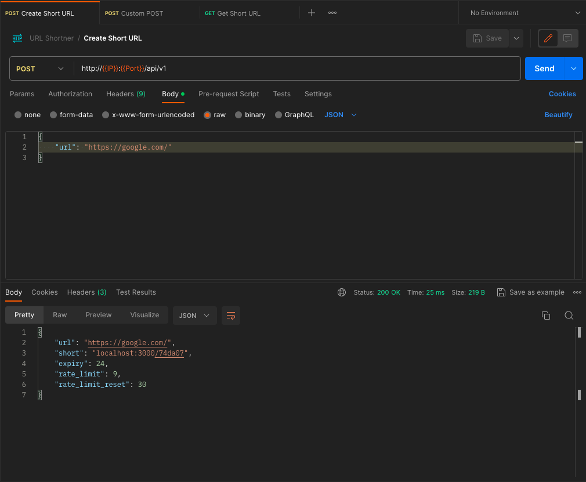
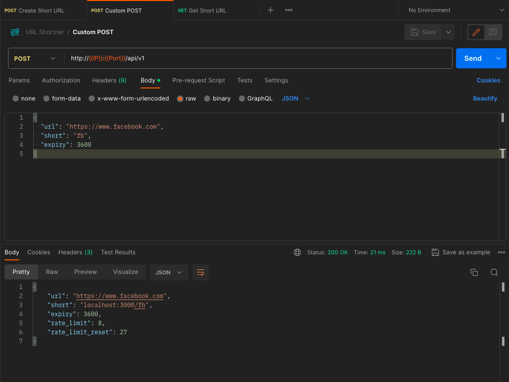
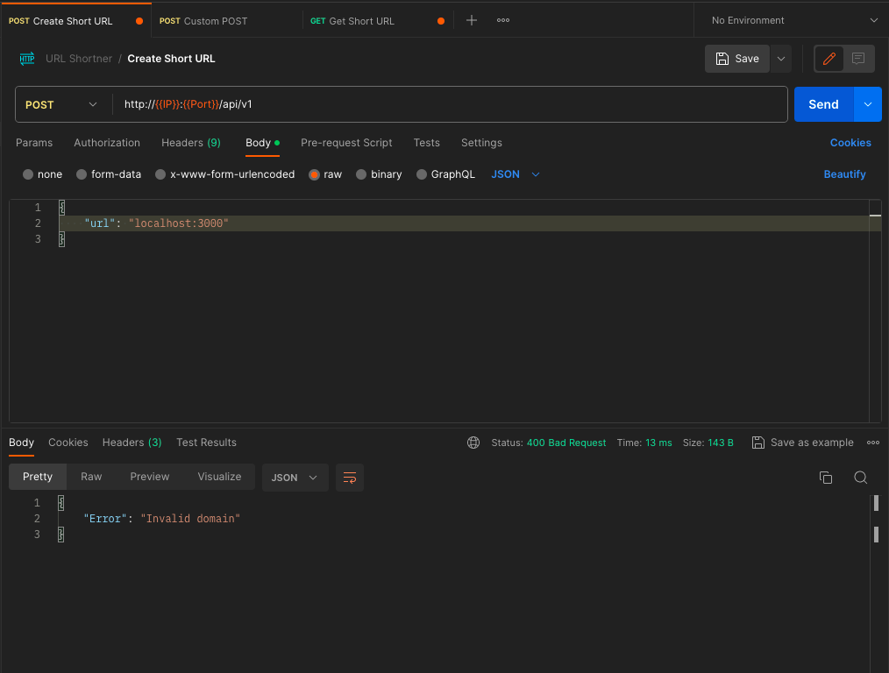
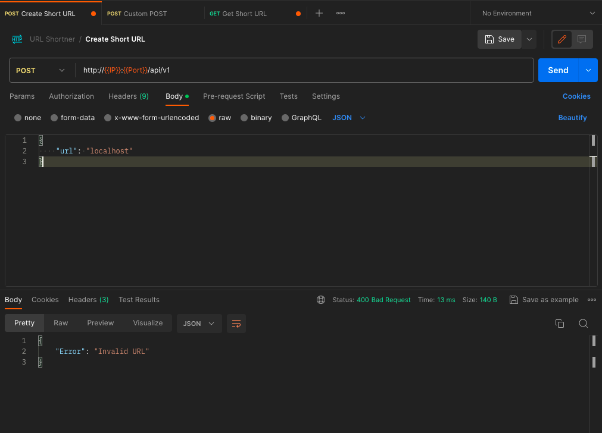
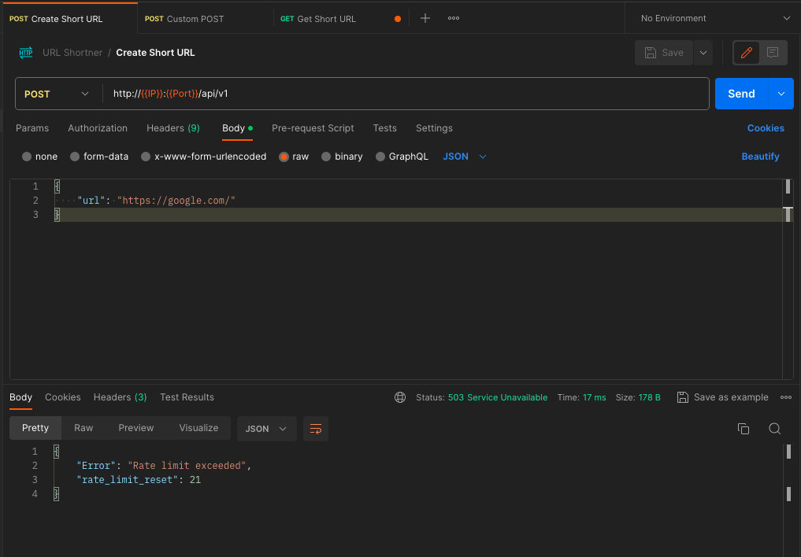
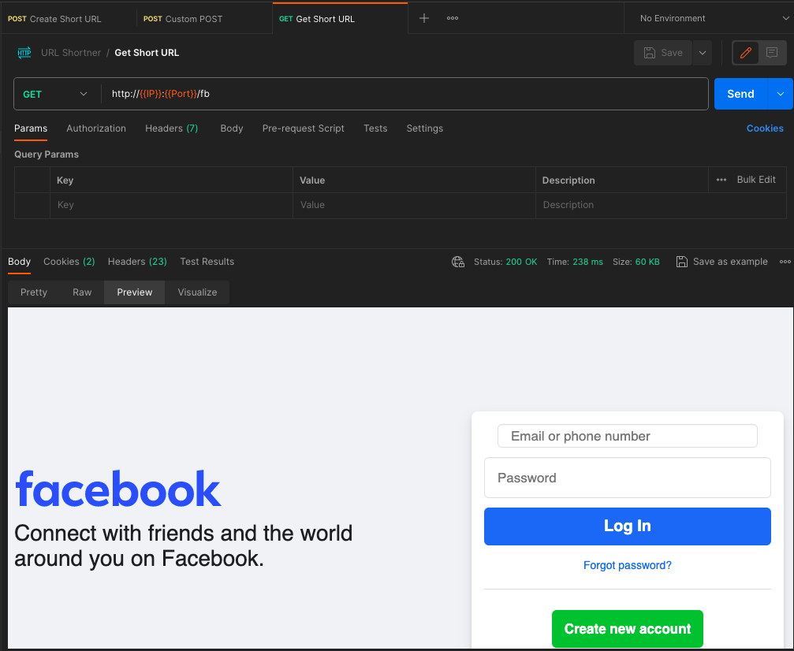
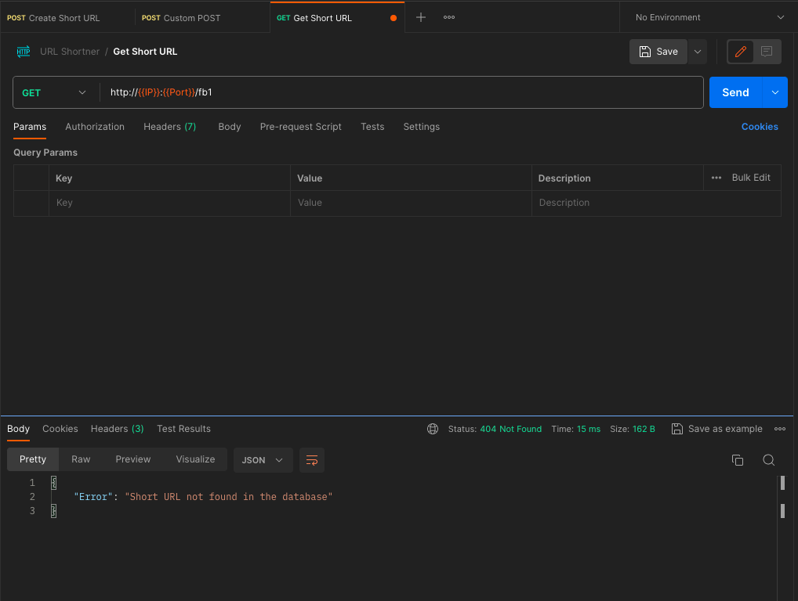
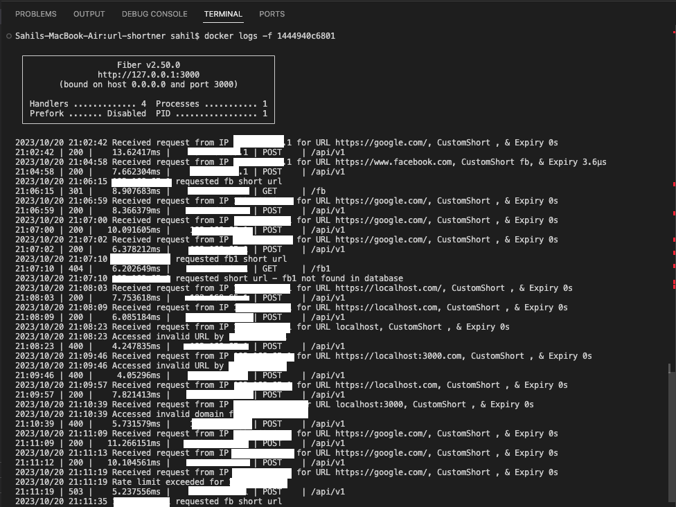

---

# URL Shortener

This is a simple URL shortener service that allows users to convert long URLs into shorter, more manageable links. It's built with Go (Golang) and uses the Fiber web framework for the API. The service also utilizes Redis for rate limiting and storing short URL mappings.

## Table of Contents

- [Getting Started](#getting-started)
- [Usage](#usage)
- [API Endpoints](#api-endpoints)
- [Rate Limiting](#rate-limiting)
- [Configuration](#configuration)
- [Supported Scenarios](#scenarios)
- [Screenshots](#screenshots)
- [License](#license)

## Getting Started

To get started with this URL shortener service, follow these steps:

1. Clone the repository to your local machine.

   ```bash
   git clone https://github.com/sahilsangani98/url-shortener.git
   ```

2. Install the required dependencies. Make sure you have Go and Redis installed.

3. Set up the environment variables. You can use a `.env` file or directly set them in your system. Required environment variables include:
   - `API_QUOTA`: The rate limit for API requests.
   - `URL_RETENTION_TIME`: The default URL expiration time.
   - `DOMAIN`: The domain for the short URLs.

4. Build and run the application.

   ```bash
   bash manage-service.sh [start] | [stop]
   ```

## Usage

Once the application is running, you can use it to shorten URLs via the API. Here's an example of how to shorten a URL using cURL:

```bash
curl --location 'http://127.0.0.1:3000/api/v1' \
--header 'Content-Type: application/json' \
--data '{
    "url": "https://www.google.com/"
}'
```

```bash
curl --location 'http://127.0.0.1:3000/4beb8a' \
--data ''
```

```bash
curl --location 'http://127.0.0.1:3000/api/v1' \
--header 'Content-Type: application/json' \
--data '{
  "url": "https://www.facebook.com",
  "short": "custom1234567",
  "expiry": 3600}'
```

You will receive a JSON response with the shortened URL.

## API Endpoints

The URL shortener service provides the following API endpoints:

- `POST /shorten`: Shorten a long URL. You can provide an optional custom short URL and expiration time.

- `GET /:shortURL`: Redirect to the original URL associated with the provided short URL.

## Rate Limiting

The service enforces rate limiting to prevent abuse. The rate limit allows users to send a specified number of requests every 30 minutes. If the rate limit is exceeded, you'll receive a `429 Too Many Requests` response.

## Configuration

The service uses environment variables for configuration. You can customize the behavior by modifying these variables:

- `API_QUOTA`: Rate limit for API requests.
- `URL_RETENTION_TIME`: Default URL expiration time.
- `DOMAIN`: Domain for the short URLs.

## Supported Scenarios

1. Shortening URLs
1.1 POST Request:
- When a POST request is made with a URL to be shortened, the service responds with a JSON object containing the shortened URL and its associated rate limit.

1.2 POST Request with Custom Short Code and Expiry:
- When a POST request is made with a URL, a custom short code, and an expiry (retention time in the database), the service responds with a JSON object containing the shortened URL, its rate limit, and the custom short code.

2. Redirecting Shortened URLs
2.1 GET Request with Short URL:
- When a GET request is made with a shortened URL, the service redirects the request to the original URL if it exists in the database.

2.2 GET Request with Non-Existent Short URL:
- When a GET request is made with a shortened URL that does not exist in the database, the service raises an error indicating that the URL is not found in the database.

We welcome contributions! If you want to improve this URL shortener or fix issues, feel free to submit pull requests. Please make sure to follow the code of conduct and contribute in a respectful and friendly manner.

## Screenshots

<!-- Create Short URL -->


<!-- Create Custom Short URL -->


<!-- Invalid Domain -->


<!-- Invalid URL -->


<!-- Rate Limit Exceeded -->


<!-- Retrieve Short URL -->


<!-- Short URL Not Found -->


<!-- Sample Logs -->


## License

This URL shortener is open-source and licensed under the MIT License. You can find more details in the [LICENSE](LICENSE) file.

---

This README provides a brief introduction to your URL shortener project. You should further expand it to include more details about installation, deployment, usage, and any other relevant information specific to your project.